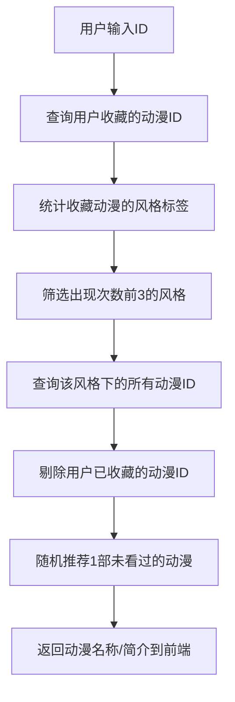

# 动漫个性化推荐系统


一个轻量级但完整的「基于用户行为的动漫推荐系统」，通过分析用户收藏的动漫风格偏好，推荐同风格且未看过的动漫，实现从「终端逻辑」到「Web 可视化」的完整闭环。


### 项目背景
本项目基于蓝桥云课「Flask+MySQL 实战」小项目的核心逻辑框架进行开发，核心目标是：
1.  理解 Web 推荐系统的基本闭环（前端交互→后端处理→数据库查询→结果返回）；
2.  适配本地 Windows 环境（解决云环境与本地环境的数据库配置差异）；
3.  完善项目工程化能力（补充 README 文档、优化目录结构、解决跨环境兼容问题）。

### 本人核心贡献
1.  环境适配：修改数据库连接逻辑，兼容蓝桥云课（无密码 MySQL）与本地 Windows（带密码 MySQL）；
2.  文档完善：编写完整的 README.md，包含环境准备、运行步骤、核心逻辑说明；
3.  工程化优化：添加 .gitignore 文件、规范目录结构，完成 GitHub 部署；
4.  数据层改造：自定义 SQL 初始化脚本（data.sql），补充测试数据与字段说明。

## 🌟 项目亮点
- 完整的前后端交互：Flask 承接前端请求，返回个性化推荐结果；
- 核心推荐逻辑：基于 SQL 统计用户风格偏好，集合差集过滤已看内容；
- 跨环境适配：兼容蓝桥云课（无密码 MySQL）和本地 Windows（带密码 MySQL）；
- 极简前端设计：表单传参 + 结果展示，聚焦核心功能，易扩展。

## 🛠 技术栈
| 分类       | 技术/工具                          | 作用                     |
|------------|------------------------------------|--------------------------|
| 后端       | Python + Flask                     | Web 框架，路由与请求处理 |
| 数据库     | MySQL/MariaDB + MySQLdb/pymysql    | 数据存储与查询           |
| 前端       | HTML + CSS                         | 页面布局与交互           |
| 核心逻辑   | SQL 子查询/分组统计 + 集合操作     | 偏好分析与内容过滤       |
| 版本管理   | Git + GitHub                       | 代码托管与版本控制       |

## 📁 项目目录结构

myproject/├── app.py # Flask 入口文件（路由配置、前后端交互）├── recommand.py # 核心推荐算法（数据库查询 + 推荐逻辑）├── data.sql # 数据库初始化脚本（表结构 + 测试数据）├── query.sql # 自定义 SQL 查询脚本（可选）├── templates/ # 前端模板文件夹（Flask 默认约定）│ ├── index.html # 首页：用户 ID 输入表单│ └── search.html # 结果页：展示推荐的动漫名称 / 简介├── .gitignore # Git 忽略文件（排除 pyc、缓存等）└── README.md # 项目说明文档（当前文件）


## 🚀 快速开始
### 1. 环境准备
#### （1）依赖安装
```bash
# 核心依赖（兼容蓝桥云课/本地）
```bash 
pip install flask mysqlclient

# 若 mysqlclient 安装失败，替换为纯 Python 实现的 pymysql
pip install flask pymysql

打开 recommand.py，修改数据库连接参数：
# 蓝桥云课版本（无密码）
db = MySQLdb.connect(
    host="localhost",
    user="root",
    passwd="",  # 空密码
    db="recommand",
    charset="utf8"
)

# 本地 Windows 版本（替换为你的密码）
db = MySQLdb.connect(
    host="localhost",
    user="root",
    passwd="你的MySQL密码",  # 例如：123456
    db="recommand",
    charset="utf8"
)

# 若使用 pymysql，需在文件开头添加
import pymysql
pymysql.install_as_MySQLdb()


打开浏览器，输入：http://127.0.0.1:5000
首页：输入用户 ID（如 1），点击「Submit」；
结果页：查看系统推荐的动漫名称和简介。


关键代码说明

1. Flask 路由（app.py）

@app.route('/search')
def search():
    # 获取前端传入的用户ID
    user_id = request.args.get('user_id')
    # 调用推荐函数
    data = recommand(user_id)
    # 渲染结果页，传递推荐数据
    return render_template('search.html', data=data)


2. 推荐核心逻辑（recommand.py）

# 筛选未看过的动漫（集合差集）
whole_love_anime_id_set = set(chain(*anime_dict.values()))
unlook_love_anime_id_set = whole_love_anime_id_set.difference(set(love_anime_id_list))
# 随机推荐
random_anime_id = choice(list(unlook_love_anime_id_set))


```


### 推荐流程（从用户行为到推荐结果） 




